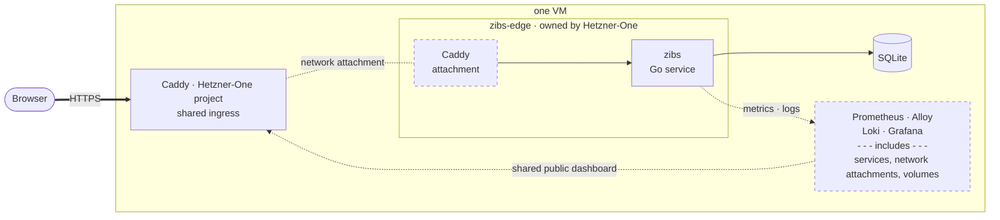

# zibs

**zibs** is a friendly link shortener — small in scope, production-grade in shape. It runs live at [zibs.app](https://zibs.app).

The app is free to use and requires a "zib" token, which you can request by email — personally. Each browser remembers the token after its first use, so it is entered once per device.

Behind the one-page frontend sits a complete, self-hosted production service: a Go application with SQLite persistence, deployed as a hardened container behind a TLS-terminating reverse proxy on a single VM, with scripted deployments, verified database backups, and a **full observability stack** — Prometheus metrics, structured logs shipped through Alloy to Loki, and Grafana dashboards provisioned straight from this repository.

- 🔗 **Try it** — [zibs.app](https://zibs.app) shortens links for people who've said hi; the site explains how to get a token.
- 📈 **Watch it run** — the [public metrics dashboard](https://zibs.app/public-dashboards/6b58a8bd322f4bbfb06f4b285055028c) shows live request rates, latency percentiles, and redirect totals. It is the deliberately limited public view of the private operator dashboard.
- ⭐ **Like what you see?** Star the repo — it helps others find it.
- 📕 There is a [**Substack article**](https://dvinubius.substack.com/p/zibs-a-link-shortener-designed-to-connect-us) describing this app, and it refers to the v1 release. Check out that [specific tree](https://github.com/dvinubius/zibs/tree/28cff4a1bb402486c5fdfde32b6e9a63e95826ca) if you want to explore the project as presented in the article.

## Architecture at a glance



Caddy is the only public entry point, managed as the separate `/opt/caddy`
Hetzner-One project, which owns both `zibs-edge` and `hooklook-edge`.
zibs joins `zibs-edge` as an external network and does not deploy Caddy. The
telemetry stack is private except for the one externally shared dashboard.

> **Article note:** [“zibs: A Link Shortener Designed to Connect Us”](https://dvinubius.substack.com/p/zibs-a-link-shortener-designed-to-connect-us?r=dqiys)
> predates the Caddy extraction and therefore depicts a different deployment
> topology. In the current deployment, Caddy is decoupled from zibs and managed
> separately from `/opt/caddy`.

This diagram is strongly simplified. The full picture — observability services, networks, volumes, port
boundaries — is in [deployment architecture](docs/deployment-architecture.md)
and [observability](docs/observability.md).

## Working locally

Install Go 1.25.0 or newer. Set a development-only admin token and start the
service directly:

```bash
ADMIN_TOKEN=development-only-token go run .
```

Open `http://localhost:8080`. The service creates `zibs.db` in the working
directory. Its private metrics endpoint is `http://127.0.0.1:9091/metrics`;
do not expose it through a public reverse proxy.

Docker Compose is also available when you want the containerized shape.
It requires the external `zibs-edge` network. On production, deploy
Hetzner-One first; for an isolated local setup, create it once with
`docker network create zibs-edge`.

```bash
ADMIN_TOKEN=development-only-token docker compose up --build
```

The application is then available at `http://127.0.0.1:8080`. The Compose
configuration keeps the metrics port private.

Run the complete test suite with:

```bash
go test -count=1 ./...
```

## Documentation

The [documentation guide](docs/README.md) covers the HTTP API, creation
frontend, service design, deployment, database backups, and observability. For
the current monitoring boundary and intentionally postponed work, start with
[Observability](docs/observability.md) and [deferred observability work](docs/v2-deferred-observability.md).

## License

The code is MIT-licensed. The visual design and brand assets are excluded — see [LICENSE](LICENSE).
