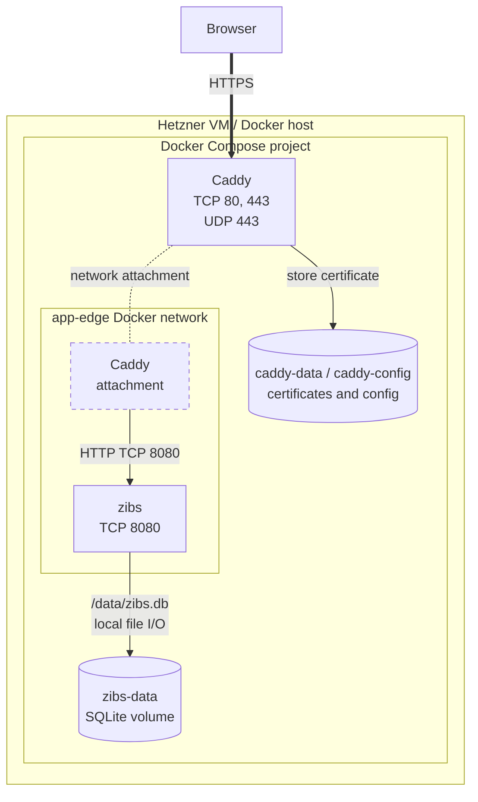

# Deployment architecture

This document describes the production request path and persistence boundary.
Telemetry components are intentionally documented separately in
[Observability](observability.md).

## Topology

All components run on one Docker host. Caddy is the only public entry point;
it obtains and renews TLS certificates after DNS for `zibs.app` points to the
host and inbound ports 80 and 443 are reachable. It forwards normal traffic to
the `zibs` service over the private `app-edge` Docker network.

## Components and boundaries

| Component | Responsibility | Exposure |
|---|---|---|
| Caddy | TLS termination, HTTP-to-HTTPS handling, reverse proxy | Host ports 80, 443, and UDP 443 |
| zibs | Public page/API, redirects, administration, SQLite access | `127.0.0.1:8080` on the VM; Caddy reaches it over `app-edge` |
| `zibs-data` volume | Durable SQLite directory mounted at `/data` | Attached only to zibs and one-off backup containers |

The application container is read-only, uses a writable `/tmp` tmpfs, drops all
Linux capabilities, and enables `no-new-privileges`. The SQLite volume remains
writable because it is the application’s durable state.

## Port inventory

| Port | Protocol | Where it is reachable | Purpose |
|---|---|---|---|
| 80 | TCP | VM public interface, Caddy only | ACME HTTP challenge and HTTP-to-HTTPS redirect |
| 443 | TCP | VM public interface, Caddy only | HTTPS |
| 443 | UDP | VM public interface, Caddy only | HTTP/3 (optional for clients) |
| 8080 | TCP | `app-edge` Docker network; VM loopback | zibs's normal HTTP API |

Telemetry ports are inventoried separately in
[Observability](observability.md); none of them is publicly reachable.

## Runtime configuration

`ADMIN_TOKEN` is required. It protects administrative endpoints and must be a
high-entropy secret, never committed to Git. The deployment script writes it to
`/opt/zibs/.env` on the VM with mode `0600`.

`CADDY_DOMAIN` defaults to `zibs.app` in Compose. Change it only when deploying
the same stack for another domain and ensure the matching DNS and TLS reachability
are in place.

## Persistence and scaling constraints

SQLite uses the `zibs-data` named volume. Mount the database directory, not
only the database file, so SQLite sidecar files remain together if WAL mode is
used. Run exactly one zibs replica against this volume: SQLite is appropriate
for this small, single-instance service and is not a shared multi-replica
database.

### When SQLite stops fitting

The expected workload — a single instance, low write concurrency, mostly
reads — is well inside SQLite's comfortable range; see
[Appropriate Uses For SQLite](https://www.sqlite.org/whentouse.html). Traffic
volume alone is not the deciding factor. Move to PostgreSQL (or another
client/server relational database) when any of these becomes true:

- two or more application instances need to serve traffic or share data;
- write contention causes unacceptable latency or `database is locked`
  failures;
- backups, replication, point-in-time recovery, failover, or read replicas
  become requirements;
- the database must live on network storage or be accessed remotely by
  multiple programs;
- administration or reporting needs require independent database access;
- the data size, retention policy, or operational risk no longer fits one
  local file and its backup process.

WAL mode can extend reader/writer concurrency before that point, with
operational trade-offs and accompanying `-wal`/`-shm` sidecar files; see the
[SQLite WAL documentation](https://sqlite.org/wal.html).

Use the SQLite-aware procedure in the [database backup runbook](database-backup-runbook.md);
never copy a live `zibs.db` file as a backup.
