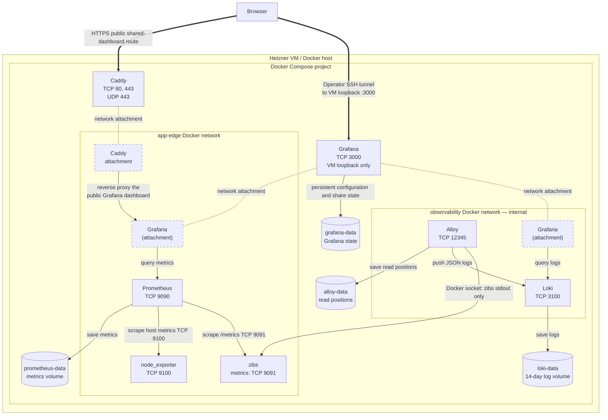

# Observability

## Stack topology

The full telemetry stack is private except for an explicitly shared,
metrics-only Grafana dashboard. The application request path is separate from
telemetry collection.



The Compose `app-edge` network connects zibs, Caddy, Prometheus,
node_exporter, and Grafana.
The internal-only `observability` network connects Alloy, Loki, and Grafana.
Grafana joins both networks so it can query both data sources. Prometheus, Loki,
Alloy, and zibs's metrics listener have no public host-port mappings. Grafana
binds only to `127.0.0.1:3000` on the VM; operators use an SSH tunnel.

### Port inventory

| Port | Protocol | Where it is reachable | Purpose |
|---|---|---|---|
| 9091 | TCP | `app-edge` Docker network only | Prometheus metrics; neither host-published nor proxied |
| 9090 | TCP | `app-edge` Docker network only | Prometheus UI and query API; not host-published |
| 9100 | TCP | `app-edge` Docker network only | node_exporter host metrics; neither host-published nor proxied |
| 3100 | TCP | Internal `observability` Docker network only | Loki API; not host-published |
| 12345 | TCP | Internal `observability` Docker network only | Alloy readiness endpoint; not host-published |
| 3000 | TCP | VM loopback only | Private Grafana workspace; operators use an SSH tunnel |

The application-path ports (80, 443, 8080) are inventoried in
[Deployment architecture](deployment-architecture.md). The only telemetry
reachable from the public internet is Grafana's externally shared
public-metrics dashboard, proxied by Caddy on its narrow route.

## Configuration inventory

| Component | Repository configuration | Durable state | Key behavior |
|---|---|---|---|
| Prometheus | [`prometheus.yml`](../prometheus.yml) | `prometheus-data` | Scrapes `zibs:9091` and `node-exporter:9100` every 30 seconds |
| node_exporter | [`compose.yaml`](../compose.yaml) | none | Private, read-only view of host `/`, `/proc`, and `/sys` for VM capacity metrics |
| Alloy | [`config.alloy`](../config.alloy) | `alloy-data` | Discovers only Compose service `zibs`, preserves Docker JSON logs, pushes to Loki |
| Loki | [`loki.yml`](../loki.yml) | `loki-data` | Filesystem TSDB with 14-day retention |
| Grafana | [`grafana/provisioning/`](../grafana/provisioning/) and [`grafana/dashboards/`](../grafana/dashboards/) | `grafana-data` | Provisions Prometheus/Loki data sources plus private and shareable dashboards |
| Stack wiring | [`compose.yaml`](../compose.yaml) | Named volumes above | Keeps telemetry services private and makes Grafana loopback-only |

Alloy reads the Docker socket, which grants Docker-daemon-equivalent access.
Treat the VM and Alloy configuration as trusted operational infrastructure.

## Goals

zibs uses direct Prometheus instrumentation for service behavior and JSON
structured logs for request-level diagnosis. At this scale, tracing is not
required: a request crosses only the Go process and its local SQLite database.

The operational design keeps collection and full exploration private while
allowing a deliberately limited public metrics showcase.

## Instrumentation

The service creates its own Prometheus registry rather than using the global
registry. It registers Go runtime and process collectors, application metrics,
and selected `database/sql` pool statistics.

| Metric | Type | Labels | Meaning |
|---|---|---|---|
| `zibs_http_requests_total` | Counter | `route`, `method`, `status` | Completed application requests |
| `zibs_http_request_duration_seconds` | Histogram | `route`, `method` | Application request latency |
| `zibs_http_in_flight_requests` | Gauge | none | Application requests currently being handled |
| `zibs_link_operations_total` | Counter | `operation`, `result` | Create, follow, and delete outcomes |
| `zibs_db_operation_duration_seconds` | Histogram | `operation`, `result` | Database operation duration |
| `zibs_db_errors_total` | Counter | `operation`, `kind` | Database errors classified as `busy`, `constraint`, or `other` |
| `zibs_expired_links_deleted_total` | Counter | none | Rows removed by expiry cleanup |
| `zibs_expiry_cleanup_duration_seconds` | Histogram | `result` | Expiry-cleanup duration |
| `zibs_active_links` | Gauge | none | Scrape-time count of unexpired links |
| `zibs_db_open_connections` | Gauge | none | Current SQLite pool connections |
| `zibs_db_in_use_connections` | Gauge | none | Connections currently in use |
| `zibs_db_idle_connections` | Gauge | none | Idle connections |
| `zibs_db_wait_count_total` | Counter | none | Pool wait count |
| `zibs_db_wait_duration_seconds_total` | Counter | none | Total pool wait time |

Durations use seconds. HTTP and database-operation histograms start at 0.5 ms
and include 1 ms, 2 ms, 3 ms, and 5 ms buckets before the wider service-level
ranges. The `route` label is normalized (for example, `/{code}` and
`/admin/links/{code}`), not the raw request path.

`zibs_active_links` queries SQLite on each metrics scrape. It counts only rows
whose `expires_at` is later than the collection time, so expired rows are not
reported as active during the interval before periodic cleanup deletes them. A
query that cannot complete within one second reports `NaN`, rather than a
misleading zero.

`zibs_http_in_flight_requests` increments immediately before the application
handler runs and decrements when it returns, including an error response. It is
a diagnostic snapshot of concurrent work, not a request-rate or throughput
metric. With the normal 30-second scrape interval, fast requests usually begin
and finish between scrapes, so an observed zero is expected at this traffic
level.

Prometheus 3 normalizes classic-histogram `le` label values when it ingests
them. Dashboard queries that select an integer bucket directly must therefore
use the normalized form (for example, `le="2.0"`), even though zibs exposes
that bucket as `le="2"` on its metrics endpoint.

Do not add a short code, destination URL, raw path, client IP, request ID, or
error text as a Prometheus label. Those values are high-cardinality or may be
sensitive. Keep them in the structured log body when needed for diagnosis.

`zibs_db_errors_total` records only failed database work. Expected application
outcomes such as a missing link or an invalid creation token are represented by
the duration histogram's bounded `result` label, not as database errors. Both
SQLite `BUSY` and `LOCKED` errors use `kind="busy"`; all other error messages
remain out of metric labels.

### Logs

The production logger writes JSON to standard output. Completed-request records
include a bounded route, raw path (without its query string), method, status,
and `duration_ms`; failed requests also have the bounded `error_category`
(`client` or `server`). Raw paths retain short codes and scanner probes for
private operator diagnosis. Logs intentionally do not include query strings,
bearer tokens, request bodies, or destination URLs.

SQLite operation failures additionally record a bounded operation and error
category plus the underlying error text. Store queries use parameter binding, so
their error text does not interpolate a short code, destination URL, token, or
other request value. These records are private diagnostic data, not Loki labels.
Startup, shutdown, and expiry-cleanup events are also logged.

The production Compose profile uses Grafana Alloy to collect only zibs's
container stdout and send it to Loki. Alloy discovers the zibs service through
the Docker socket, which grants it Docker-daemon-equivalent access; treat it as
a trusted, private component. Loki and Alloy are attached only to the internal
`observability` network and neither publishes a host port. Use a small fixed
Loki label set:

```text
service=zibs
environment=production
container=zibs
```

Request-specific data remains JSON fields, not Loki labels. This preserves
query usefulness without creating unbounded indexed label values. Loki stores
these logs in its persistent `loki-data` volume for 14 days; Alloy stores its
read positions in `alloy-data` so it can resume after a restart.

The private operator dashboard links its 5xx and latency panels to bounded Loki
queries for the selected dashboard time range. Those links query only
server-classified completed requests or requests with `duration_ms >= 1000`.
They must remain on the private operator dashboard; the public dashboard must
not link to Loki or expose logs.

## Metrics access boundary

`GET /metrics` runs on a separate listener, `127.0.0.1:9091` by default. It
uses the service's private registry and is not registered on the public
application handler. `METRICS_ADDRESS` overrides that bind address; Compose
sets it to `0.0.0.0:9091` so the Prometheus container can connect over the
private Docker network.

On a VM, Prometheus should scrape this localhost listener. In a container
deployment, do not publish the metrics port to the host; permit it only on the
private application/Prometheus network. Compose uses `expose` as documentation
of the container port and has no host-port mapping for `9091`. The reverse
proxy must not forward `/metrics` publicly.

Prometheus scrape requests are not application requests. The metrics handler
therefore does not use the application's request logging or HTTP-metrics
middleware.

## Dashboards

The production Compose profile runs Grafana on `127.0.0.1:3000` of the VM.
It has no public port mapping, disables anonymous access and user sign-up, and
requires a separate `GRAFANA_ADMIN_PASSWORD`. Operators reach it over an SSH
tunnel. Grafana connects to Prometheus through `app-edge` and Loki through the
internal `observability` network; neither data source is reachable from the
public internet.

Grafana provisions both data sources and these dashboards from `grafana/` in
the repository at startup:

- **zibs operator overview** is private and includes request, latency, link
  operation, database duration/error and SQLite-pool panels, fixed 24-hour/7-day
  business summaries, expiry-cleanup, process/runtime, and VM CPU, memory,
  load, root-filesystem, disk-I/O, and network panels, plus the Loki log panel
  filtered to `service=zibs`.
- **zibs public metrics** is a deliberately metrics-only dashboard. It has no
  variables or annotations, and its queries return only aggregate request and
  status counts, latency percentiles, 24-hour/7-day redirect and creation
  totals, the active-link count, and the Prometheus `up` signal.

`grafana-data` persists Grafana's own SQLite database. It retains the
administrator account, externally-shared-dashboard state when that feature is
enabled, user preferences, and any future data not defined by the provisioning
files. The provisioned data sources and dashboards remain reproducible from
Git, but are not a replacement for that runtime state.

### Telemetry smoke test

`scripts/telemetry-smoke-test.sh` runs on the VM after each full deployment and
can be run manually from `/opt/zibs`. It sends a zibs health request, verifies
that Prometheus reports both `up{job="zibs"} = 1` and `up{job="node"} = 1`.
It then waits for a zibs log entry in Loki, checks Grafana's HTTP API and its
provisioned Prometheus and Loki data sources, and verifies both provisioned
dashboard UIDs. This is an integration check of the complete metrics-and-logs
path, not merely a container liveness check.

### Alerting status

No alerts are configured yet. Alert delivery, credential storage, thresholds,
and end-to-end notification testing are intentionally deferred until the
project has an operational need for them. The operator dashboard and the
telemetry smoke test remain the current ways to detect and investigate service
conditions. See [deferred observability work](v2-deferred-observability.md)
for the planned triggers and boundaries.

## Public dashboard

The public-metrics dashboard is served through the `zibs.app` Caddy host at
`/public-dashboards/<shared-dashboard-token>`. Caddy proxies only the
externally shared dashboard page, Grafana's anonymous shared-dashboard API, and
its required public assets; it does not proxy the normal Grafana workspace or
the general Grafana API. After reviewing its saved panels, enable **Anyone with
the link** from the dashboard's **Share externally** drawer. Keep time-range
selection and annotations disabled. Pause or revoke the share from that drawer
whenever the dashboard changes or must be taken offline.
Use Grafana's externally shared-dashboard mechanism rather than anonymous
Viewer access to the Grafana workspace: the shared view can run only the
dashboard's saved queries, while a workspace viewer could explore data more
broadly.

The public dashboard may include aggregated request rate, status proportions,
latency percentiles, redirect and creation totals, the active-link count, and
the service-up signal. It must not include:

- raw Loki logs;
- raw paths or live short codes;
- destination URLs, tokens, request identifiers, or client information;
- direct data-source access, Explore, or the broader Grafana workspace.

Review every saved query before sharing, watch the query load generated by the
public link, and retain the ability to pause or revoke the share. The full
Grafana workspace, Prometheus, Loki, and metrics endpoint remain private.

## Operator dashboard runbook

### Open the private workspace

Grafana is intentionally loopback-only on the VM. From an operator machine,
create a tunnel and open the local address:

```bash
ssh -L 3000:127.0.0.1:3000 root@<host>
```

Then visit `http://localhost:3000`, sign in with `GRAFANA_ADMIN_USER` (default
`admin`) and `GRAFANA_ADMIN_PASSWORD`, and open **Zibs → zibs operator
overview**. Do not expose port 3000 publicly or enable anonymous workspace
access.

### Change the dashboard layout

Both dashboards use Grafana's **Classic** JSON model and are provisioned from
the repository, so Grafana exports UI edits instead of saving them to its
database. Grafana `13.0.x` has an upstream regression: **Save dashboard** emits
a concrete V2 dashboard definition (`elements` and `layout`) even when the
drawer says **Model: Classic**. The file provider rejects that V2 output. The
[fix is merged for Grafana `13.3.x`](https://github.com/grafana/grafana/pull/131718);
until this deployment runs a release that contains it, use the
[V2-layout conversion procedure](deployment-runbook.md#convert-a-grafana-v2-layout)
in the deployment runbook. Do not edit the container path
`/var/lib/grafana/dashboards`: it is a read-only bind mount. The repository is
the durable source of truth.

### Normal operating checks

Use the dashboard time range that covers the reported issue, then review:

1. **Availability:** Prometheus `up` should be `1`; a missing target means the
   scrape path, application metrics listener, or network needs investigation.
2. **Request behavior:** compare request rate, status distribution, and the
   normal-range latency panel. Its visual cap keeps isolated slow requests
   from obscuring ordinary millisecond-scale behavior. Check **Requests over
   2 seconds in selected period** and then private Loki logs for the exact
   duration and request context of any slow work. Sustained 5xx responses
   require application-log review.
3. **Link operations and cleanup:** look for failed create, follow, delete, or
   expiry-cleanup results. Expired links are removed at startup and every 24
   hours.
4. **SQLite pool and latency:** elevated waits, in-use connections, or database
   latency can indicate a stuck or overloaded local process.
5. **Logs:** use the Loki panel filtered to `service=zibs` to correlate a time
   window with JSON request, startup, shutdown, or cleanup records. Keep
   request-specific fields in the log body, not Loki labels.
6. **Host capacity:** check CPU, memory, and load together before diagnosing
   saturation. The filesystem panels intentionally cover only `/`: on this VM
   it is the ext4 filesystem that holds Docker, SQLite, backups, and telemetry
   state. Compare free bytes and headroom with `df -B1 /` on the VM. Disk and
   network panels exclude loopback and Docker virtual interfaces to focus on
   host resource use.

### Host-metrics boundary

The production VM mount inventory was reviewed before enabling host metrics.
It has a capacity-relevant ext4 root filesystem (`/` on `/dev/sda1`), a small
EFI vfat mount, and Docker overlay, pseudo, and temporary mounts. The pinned
`prom/node-exporter:v1.11.1` image was released on 2026-04-07, exceeding this
repository's three-week package-age minimum at implementation time. It is
attached only to `app-edge`, publishes no host port, drops all Linux
capabilities, enables `no-new-privileges`, and receives a read-only recursive
slave mount of `/`. Its root, proc, and sys paths point inside that mount.

The filesystem collector excludes pseudo filesystems, Docker's overlay mount
tree, and `/boot/efi`, so the expected capacity series is the ext4 root only.
The exporter can still reveal host metadata and resource usage; keep it private
and do not attach it to the public dashboard.

### After a deployment

Run the telemetry smoke test from `/opt/zibs`:

```bash
./scripts/telemetry-smoke-test.sh
```

It sends a health request, confirms Prometheus sees both the `zibs` and `node`
targets as up, waits for a zibs log in Loki, checks Grafana and both data
sources, and checks both provisioned dashboard UIDs. A pass verifies the
telemetry path end to end; it does not replace reviewing application behavior.

### Validating the in-flight request gauge in production

Normal requests are too brief to reliably appear in a scrape. After deploying
the application change, use an already-authorized creation token to send one
deliberately incomplete request body and keep its input stream open for at
least 70 seconds. The route authenticates first, then waits for the incomplete
JSON body; it cannot create a link. This consumes that single-use creation
token, so issue a disposable one specifically for the check.

In one terminal, keep the request open (replace the placeholder only in your
shell; do not put a real token in a command history or commit):

```bash
read -rs ZIBS_CREATION_TOKEN
export ZIBS_CREATION_TOKEN
{ printf '{'; sleep 70; } | curl --http1.1 --no-buffer --request POST --upload-file - \
  --header 'Expect:' \
  --header 'Transfer-Encoding: chunked' \
  --header "Authorization: Bearer $ZIBS_CREATION_TOKEN" \
  --header 'Content-Type: application/json' https://zibs.app/links
unset ZIBS_CREATION_TOKEN
```

While it is open, wait for one Prometheus scrape and confirm the private
operator dashboard's **In-flight requests** panel reads `1`; it may take up to
30 seconds to change. Once the stream closes, wait for the next scrape and
confirm it returns to `0`. The request should end with HTTP 400 because its
body is invalid, which is expected. Do not use the public dashboard for this
check: the panel is intentionally operator-only.

### Share only the public dashboard

The **zibs public metrics** dashboard is the only dashboard that may be shared.
In Grafana, open it and use **Share → Share externally**, choose **Anyone with
the link**, and leave time-range selection and annotations disabled. Caddy
proxies only the narrow shared-dashboard route and required assets. Review every
saved panel before enabling a share, and pause or revoke it from the same drawer
when it is no longer appropriate. Never share the operator dashboard.
