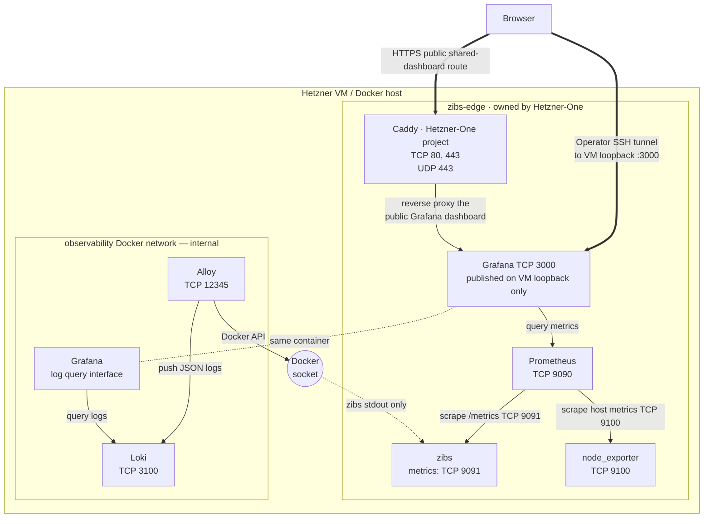
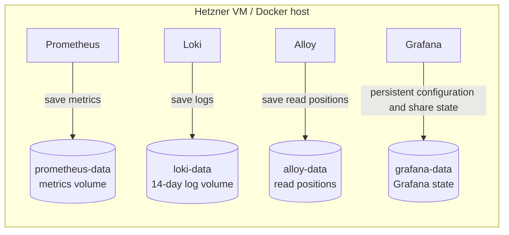

# Observability

## Stack topology

The full telemetry stack is private except for an explicitly shared,
metrics-only Grafana dashboard. The application request path is separate from
telemetry collection.


```mermaid
flowchart TB
    browser[Browser]

    subgraph host[Hetzner VM / Docker host]
        subgraph edge[zibs-edge · owned by Hetzner-One]
            caddy[Caddy · Hetzner-One project<br/>TCP 80, 443<br/>UDP 443]
            zibs[zibs<br/>metrics: TCP 9091]
            prometheus[Prometheus<br/>TCP 9090]
            nodeExporter[node_exporter<br/>TCP 9100]
            grafanaEdge[Grafana TCP 3000<br/>published on VM loopback only]
        end
        subgraph observability[observability Docker network — internal]
            loki[Loki<br/>TCP 3100]
            alloy[Alloy<br/>TCP 12345]
            grafanaObservability[Grafana<br/>log query interface]
        end
        socket((Docker<br/>socket))
    end

    browser ==>|Operator SSH tunnel<br/>to VM loopback :3000| grafanaEdge
    browser ==>|HTTPS public shared-dashboard route| caddy
    caddy -->|reverse proxy the<br/>public Grafana dashboard| grafanaEdge
    prometheus -->|scrape /metrics TCP 9091| zibs
    prometheus -->|scrape host metrics TCP 9100| nodeExporter
    alloy -->|Docker API| socket
    socket -.->|zibs stdout only| zibs
    alloy -->|push JSON logs| loki
    grafanaEdge -.-|same container| grafanaObservability
    grafanaEdge -->|query metrics| prometheus
    grafanaObservability -->|query logs| loki
```

The two Grafana boxes represent the network attachments of one container.
Grafana's loopback port publication goes through `zibs-edge`, the only
non-internal network it joins.

### Volumes

Each telemetry service keeps its durable state in its own Docker named volume.
No volume is shared between containers.


```mermaid
flowchart LR
    subgraph host[Hetzner VM / Docker host]
        prometheus[Prometheus] -->|save metrics| prometheusData[(prometheus-data<br/>metrics volume)]
        loki[Loki] -->|save logs| lokiData[(loki-data<br/>14-day log volume)]
        alloy[Alloy] -->|save read positions| alloyData[(alloy-data<br/>read positions)]
        grafana[Grafana] -->|persistent configuration and share state| grafanaData[(grafana-data<br/>Grafana state)]
    end
```

> **Article note:** [“zibs: A Link Shortener Designed to Connect Us”](https://dvinubius.substack.com/p/zibs-a-link-shortener-designed-to-connect-us?r=dqiys)
> predates the Caddy extraction. It shows an older topology; the current Caddy
> service is managed separately by [Hetzner-One](https://github.com/dvinubius/hetzner-one) from `/opt/caddy`, which owns `zibs-edge`
> for the application and its narrow public-dashboard route.

[Hetzner-One](https://github.com/dvinubius/hetzner-one) (the `/opt/caddy` Compose project) owns `zibs-edge` and
`hooklook-edge`. zibs joins `zibs-edge` externally, like Hooklook joins
`hooklook-edge`. The current zibs network connects zibs, Prometheus,
node_exporter, Grafana, and shared Caddy. Hetzner-One owns Caddy's public
ports, routing, and certificate state. Further telemetry segmentation is
deferred to [the topology plan](v2-topology-improvements.md).

Alloy collects only zibs application logs. Caddy access/error log collection
belongs to Hetzner-One as a future host-level/shared mechanism; this cleanup
does not add or migrate a Caddy log stream.
The internal-only `observability` network connects Alloy, Loki, and Grafana.
Grafana joins both networks so it can query both data sources. Prometheus, Loki,
Alloy, and zibs's metrics listener have no public host-port mappings. Grafana
binds only to `127.0.0.1:3000` on the VM; operators use an SSH tunnel.

### Port inventory

| Port | Protocol | Where it is reachable | Purpose |
|---|---|---|---|
| 9091 | TCP | `zibs-edge` Docker network only | Prometheus metrics; neither host-published nor proxied |
| 9090 | TCP | `zibs-edge` Docker network only | Prometheus UI and query API; not host-published |
| 9100 | TCP | `zibs-edge` Docker network only | node_exporter host metrics; neither host-published nor proxied |
| 3100 | TCP | Internal `observability` Docker network only | Loki API; not host-published |
| 12345 | TCP | Internal `observability` Docker network only | Alloy readiness endpoint; not host-published |
| 3000 | TCP | VM loopback only | Private Grafana workspace; operators use an SSH tunnel |

The application-path ports (80, 443, 8080) are inventoried in
[Deployment architecture](deployment-architecture.md). The only telemetry
reachable from the public internet is Grafana's externally shared
public-metrics dashboard, proxied by Caddy on its narrow route.

## Configuration inventory

| Component | Repository configuration | Durable state | Key behavior |
|---|---|---|---|
| Prometheus | [`prometheus.yml`](../prometheus.yml) | `prometheus-data` | Scrapes `zibs:9091` and `node-exporter:9100` every 30 seconds |
| node_exporter | [`compose.yaml`](../compose.yaml) | none | Private, read-only view of host `/`, `/proc`, and `/sys` for VM capacity metrics |
| Alloy | [`config.alloy`](../config.alloy) | `alloy-data` | Discovers only Compose service `zibs`, preserves Docker JSON logs, pushes to Loki |
| Loki | [`loki.yml`](../loki.yml) | `loki-data` | Filesystem TSDB with 14-day retention |
| Grafana | [`grafana/provisioning/`](../grafana/provisioning/) and [`grafana/dashboards/`](../grafana/dashboards/) | `grafana-data` | Provisions Prometheus/Loki data sources plus private and shareable dashboards |
| Stack wiring | [`compose.yaml`](../compose.yaml) | Named volumes above | Keeps telemetry services private and makes Grafana loopback-only |

Alloy reads the Docker socket, which grants Docker-daemon-equivalent access.
Treat the VM and Alloy configuration as trusted operational infrastructure.

## Goals

zibs uses direct Prometheus instrumentation for service behavior and JSON
structured logs for request-level diagnosis. At this scale, tracing is not
required: a request crosses only the Go process and its local SQLite database.

The operational design keeps collection and full exploration private while
allowing a deliberately limited public metrics showcase.

## Instrumentation

The service creates its own Prometheus registry rather than using the global
registry. It registers Go runtime and process collectors, application metrics,
and selected `database/sql` pool statistics.

| Metric | Type | Labels | Meaning |
|---|---|---|---|
| `zibs_http_requests_total` | Counter | `route`, `method`, `status`, `traffic_class` | Completed application requests |
| `zibs_http_request_duration_seconds` | Histogram | `route`, `method`, `traffic_class` | Application request latency |
| `zibs_http_in_flight_requests` | Gauge | none | Application requests currently being handled |
| `zibs_link_operations_total` | Counter | `operation`, `result`, `traffic_class` | Create, follow, and delete outcomes |
| `zibs_db_operation_duration_seconds` | Histogram | `operation`, `result` | Database operation duration |
| `zibs_db_errors_total` | Counter | `operation`, `kind` | Database errors classified as `busy`, `constraint`, or `other` |
| `zibs_expired_links_deleted_total` | Counter | none | Rows removed by expiry cleanup |
| `zibs_expiry_cleanup_duration_seconds` | Histogram | `result` | Expiry-cleanup duration |
| `zibs_active_links` | Gauge | none | Scrape-time count of unexpired links |
| `zibs_db_open_connections` | Gauge | none | Current SQLite pool connections |
| `zibs_db_in_use_connections` | Gauge | none | Connections currently in use |
| `zibs_db_idle_connections` | Gauge | none | Idle connections |
| `zibs_db_wait_count_total` | Counter | none | Pool wait count |
| `zibs_db_wait_duration_seconds_total` | Counter | none | Total pool wait time |

### Traffic classes

Every completed application request has exactly one `traffic_class` value:

| Value | Rule | Meaning |
|---|---|---|
| `synthetic` | User-Agent starts with `zibs-traffic-lab/` | Request marked by the synthetic generator. The marker is attribution, not authentication. |
| `other` | An application route with its own method (`/`, `/static/*`, `/health`, `/links`, `/admin/links`, `/admin/links/{code}`, `/admin/tokens`, `/admin/tokens/{id}`), or a `GET`/`HEAD` to a path shaped like a short code: exactly eight letters or digits | Possible ordinary use. It can still include bots, health checks, and your own admin calls. |
| `suspected_scan` | Everything else: other paths, and application paths with a wrong method | Requests that cannot be ordinary use of zibs: probes (`/.env`, `/wp-login.php`, `/admin`), crawler and browser files (`/robots.txt`, `/apple-touch-icon.png`), and wrong methods (`POST /graphql`). |

The synthetic rule takes precedence. Every short code ever issued has eight
characters from the same alphabet, so a path of any other shape cannot be a
link. A link that is mangled when copied, for example with trailing
punctuation, therefore counts as a suspected scan. The generator sends its
User-Agent on token provisioning, link creation, and redirect requests. Raw
paths and User-Agents are never Prometheus labels. Request logs include only the
bounded `traffic_class`; paths remain in the private log body. Link-operation
counters inherit the class of the request that caused them. Database, expiry,
active-link, process, and host metrics remain global because they cannot be
attributed reliably to an individual request class.

The original operator dashboard remains the all-traffic view. Private
synthetic, suspected-scan, and other dashboards filter request and
link-operation metrics by class. The other dashboard excludes marked
synthetic traffic and every request that cannot be ordinary use, so its link
misses are code-shaped follows only. `other` is still not a verified-human
count. Historical metrics and logs from before this class was recorded cannot
be partitioned retroactively. Until the route-based rule above was deployed,
`suspected_scan` matched only a fixed list of probe paths (`.php`, `/wp-`,
`/xmlrpc`, and a few `POST` probes), so earlier `other` data includes
unrecognised probes and crawler files. Keep the scan view alongside the
visitor view; do not discard probe requests at collection time.

Durations use seconds. HTTP and database-operation histograms start at 0.5 ms
and include 1 ms, 2 ms, 3 ms, and 5 ms buckets before the wider service-level
ranges. The `route` label is normalized (for example, `/{code}` and
`/admin/links/{code}`), not the raw request path.

`zibs_active_links` queries SQLite on each metrics scrape. It counts only rows
whose `expires_at` is later than the collection time, so expired rows are not
reported as active during the interval before periodic cleanup deletes them. A
query that cannot complete within one second reports `NaN`, rather than a
misleading zero.

`zibs_http_in_flight_requests` increments immediately before the application
handler runs and decrements when it returns, including an error response. It is
a diagnostic snapshot of concurrent work, not a request-rate or throughput
metric. With the normal 30-second scrape interval, fast requests usually begin
and finish between scrapes, so an observed zero is expected at this traffic
level.

Prometheus 3 normalizes classic-histogram `le` label values when it ingests
them. Dashboard queries that select an integer bucket directly must therefore
use the normalized form (for example, `le="2.0"`), even though zibs exposes
that bucket as `le="2"` on its metrics endpoint.

Do not add a short code, destination URL, raw path, client IP, request ID, or
error text as a Prometheus label. Those values are high-cardinality or may be
sensitive. Keep them in the structured log body when needed for diagnosis.

`zibs_db_errors_total` records only failed database work. Expected application
outcomes such as a missing link or an invalid creation token are represented by
the duration histogram's bounded `result` label, not as database errors. Both
SQLite `BUSY` and `LOCKED` errors use `kind="busy"`; all other error messages
remain out of metric labels.

### Logs

The production logger writes JSON to standard output. Completed-request records
include a bounded route, raw path (without its query string), method, status,
`traffic_class`, and `duration_ms`; failed requests also have the bounded `error_category`
(`client` or `server`). Raw paths retain short codes and scanner probes for
private operator diagnosis. Logs intentionally do not include query strings,
bearer tokens, request bodies, or destination URLs.

SQLite operation failures additionally record a bounded operation and error
category plus the underlying error text. Store queries use parameter binding, so
their error text does not interpolate a short code, destination URL, token, or
other request value. These records are private diagnostic data, not Loki labels.
Startup, shutdown, and expiry-cleanup events are also logged.

The production Compose profile uses Grafana Alloy to collect only zibs's
container stdout and send it to Loki. Alloy discovers the zibs service through
the Docker socket, which grants it Docker-daemon-equivalent access; treat it as
a trusted, private component. Loki and Alloy are attached only to the internal
`observability` network and neither publishes a host port. Use a small fixed
Loki label set:

```text
service=zibs
environment=production
container=zibs
```

Request-specific data remains JSON fields, not Loki labels. This preserves
query usefulness without creating unbounded indexed label values. Loki stores
these logs in its persistent `loki-data` volume for 14 days; Alloy stores its
read positions in `alloy-data` so it can resume after a restart.

The private operator dashboard links its 5xx and latency panels to bounded Loki
queries for the selected dashboard time range. Those links query only
server-classified completed requests or requests with `duration_ms >= 1000`.
They must remain on the private operator dashboard; the public dashboard must
not link to Loki or expose logs.

## Metrics access boundary

`GET /metrics` runs on a separate listener, `127.0.0.1:9091` by default. It
uses the service's private registry and is not registered on the public
application handler. `METRICS_ADDRESS` overrides that bind address; Compose
sets it to `0.0.0.0:9091` so the Prometheus container can connect over the
private Docker network.

On a VM, Prometheus should scrape this localhost listener. In a container
deployment, do not publish the metrics port to the host; permit it only on the
private application/Prometheus network. Compose uses `expose` as documentation
of the container port and has no host-port mapping for `9091`. The reverse
proxy must not forward `/metrics` publicly.

Prometheus scrape requests are not application requests. The metrics handler
therefore does not use the application's request logging or HTTP-metrics
middleware.

## Dashboards

The production Compose profile runs Grafana on `127.0.0.1:3000` of the VM.
It has no public port mapping, disables anonymous access and user sign-up, and
requires a separate `GRAFANA_ADMIN_PASSWORD`. Operators reach it over an SSH
tunnel. Grafana connects to Prometheus through `zibs-edge` and Loki through the
internal `observability` network; neither data source is reachable from the
public internet.

Grafana provisions both data sources and these dashboards from `grafana/` in
the repository at startup:

- **zibs operator overview** is private and includes request, latency, link
  operation, database duration/error and SQLite-pool panels, fixed 24-hour/7-day
  business summaries, expiry-cleanup, process/runtime, and VM CPU, memory,
  load, root-filesystem, disk-I/O, and network panels, plus the Loki log panel
  filtered to `service=zibs`.
- **zibs public metrics** is a deliberately metrics-only dashboard. It has no
  variables or annotations, and its queries return only aggregate request and
  status counts, latency percentiles, 24-hour/7-day redirect and creation
  totals, the active-link count, and the Prometheus `up` signal.

`grafana-data` persists Grafana's own SQLite database. It retains the
administrator account, externally-shared-dashboard state when that feature is
enabled, user preferences, and any future data not defined by the provisioning
files. The provisioned data sources and dashboards remain reproducible from
Git, but are not a replacement for that runtime state.

### Telemetry smoke test

`scripts/telemetry-smoke-test.sh` runs on the VM after each full or
observability deployment and can be run manually from `/opt/zibs`. It sends a
zibs health request, waits for Loki and Alloy readiness, and verifies that
Prometheus's active `zibs` and `node` targets are up. It then waits for a zibs
log entry written during the test to reach Loki, checks Grafana's HTTP API and
its provisioned Prometheus and Loki data sources, and verifies both provisioned
dashboard UIDs. Dashboard-only deployments run
`telemetry-smoke-test.sh dashboard`, which checks only that Grafana is healthy
and serves the two dashboard UIDs; it does not verify that new dashboard
content was applied. The full mode is an integration check of the complete metrics-and-logs
path, not merely a container liveness check.

### Alerting status

No alerts are configured yet. Alert delivery, credential storage, thresholds,
and end-to-end notification testing are intentionally deferred until the
project has an operational need for them. The operator dashboard and the
telemetry smoke test remain the current ways to detect and investigate service
conditions. See [deferred observability work](v2-deferred-observability.md)
for the planned triggers and boundaries.

## Public dashboard

The public-metrics dashboard is served through the `zibs.app` Caddy host at
`/public-dashboards/<shared-dashboard-token>`. Caddy proxies only the
externally shared dashboard page, Grafana's anonymous shared-dashboard API, and
its required public assets; it does not proxy the normal Grafana workspace or
the general Grafana API. After reviewing its saved panels, enable **Anyone with
the link** from the dashboard's **Share externally** drawer. Keep time-range
selection and annotations disabled. Pause or revoke the share from that drawer
whenever the dashboard changes or must be taken offline.
Use Grafana's externally shared-dashboard mechanism rather than anonymous
Viewer access to the Grafana workspace: the shared view can run only the
dashboard's saved queries, while a workspace viewer could explore data more
broadly.

The public dashboard may include aggregated request rate, status proportions,
latency percentiles, redirect and creation totals, the active-link count, and
the service-up signal. It must not include:

- raw Loki logs;
- raw paths or live short codes;
- destination URLs, tokens, request identifiers, or client information;
- direct data-source access, Explore, or the broader Grafana workspace.

Review every saved query before sharing, watch the query load generated by the
public link, and retain the ability to pause or revoke the share. The full
Grafana workspace, Prometheus, Loki, and metrics endpoint remain private.

## Operator dashboard runbook

### Open the private workspace

Grafana is intentionally loopback-only on the VM. From an operator machine,
create a tunnel and open the local address:

```bash
ssh -L 3000:127.0.0.1:3000 root@<host>
```

Then visit `http://localhost:3000`, sign in with `GRAFANA_ADMIN_USER` (default
`admin`) and `GRAFANA_ADMIN_PASSWORD`, and open **Zibs → zibs operator
overview**. Do not expose port 3000 publicly or enable anonymous workspace
access.

Be mindful of other processes using port 3000 locally, whether through `localhost`, `127.0.0.1` or IPv6 [::1]. 

### Change the dashboard layout

All five dashboards use Grafana's **Classic** JSON model and are provisioned from
the repository, so Grafana exports UI edits instead of saving them to its
database. Grafana `13.0.x` has an upstream regression: **Save dashboard** emits
a concrete V2 dashboard definition (`elements` and `layout`) even when the
drawer says **Model: Classic**. The file provider rejects that V2 output. The
[fix is merged for Grafana `13.3.x`](https://github.com/grafana/grafana/pull/131718);
until this deployment runs a release that contains it, use the
[V2-layout conversion procedure](deployment-runbook.md#convert-a-grafana-v2-layout-export)
in the deployment runbook. Do not edit the container path
`/var/lib/grafana/dashboards`: it is a read-only bind mount. The repository is
the durable source of truth.

### Reading the dashboards

[Using the dashboards](dashboard-guide.md) teaches how to read the private
dashboards: a quick routine check, investigation scenarios, query recipes,
and practice drills, including validating the in-flight request gauge.

### Host-metrics boundary

The production VM mount inventory was reviewed before enabling host metrics.
It has a capacity-relevant ext4 root filesystem (`/` on `/dev/sda1`), a small
EFI vfat mount, and Docker overlay, pseudo, and temporary mounts. The pinned
`prom/node-exporter:v1.11.1` image was released on 2026-04-07, exceeding this
repository's three-week package-age minimum at implementation time. It is
attached only to `zibs-edge`, publishes no host port, drops all Linux
capabilities, enables `no-new-privileges`, and receives a read-only recursive
slave mount of `/`. Its root, proc, and sys paths point inside that mount.

The filesystem collector excludes pseudo filesystems, Docker's overlay mount
tree, and `/boot/efi`, so the expected capacity series is the ext4 root only.
The exporter can still reveal host metadata and resource usage; keep it private
and do not attach it to the public dashboard.

### After a deployment

Run the telemetry smoke test from `/opt/zibs`:

```bash
./scripts/telemetry-smoke-test.sh
```

It sends a health request, confirms Prometheus sees both the `zibs` and `node`
targets as up, waits for a fresh zibs log in Loki, checks Grafana and both data
sources, and checks both provisioned dashboard UIDs. A pass verifies the
telemetry path end to end; it does not replace reviewing application behavior.

### Share only the public dashboard

The **zibs public metrics** dashboard is the only dashboard that may be shared.
In Grafana, open it and use **Share → Share externally**, choose **Anyone with
the link**, and leave time-range selection and annotations disabled. Caddy
proxies only the narrow shared-dashboard route and required assets. Review every
saved panel before enabling a share, and pause or revoke it from the same drawer
when it is no longer appropriate. Never share the operator dashboard.
