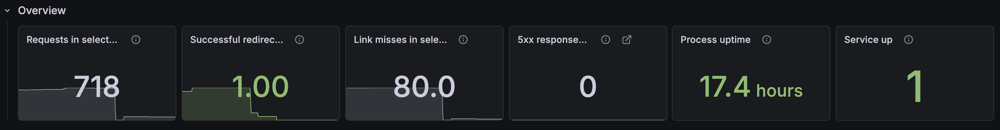
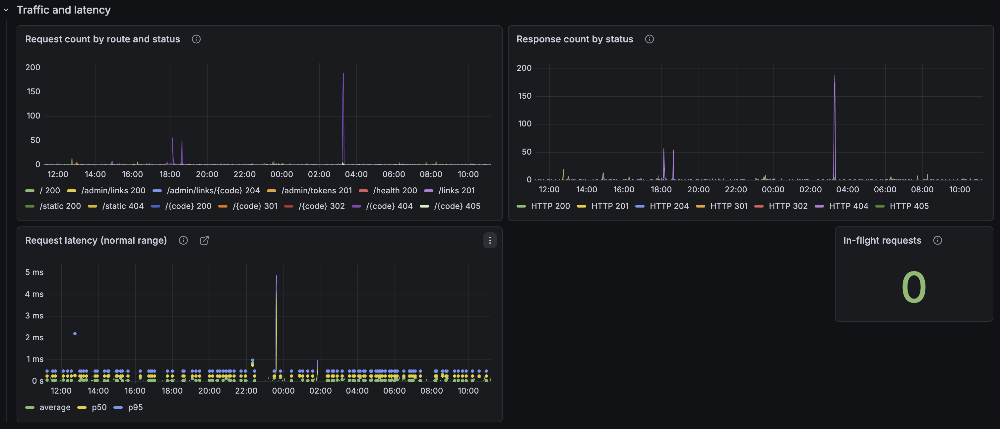
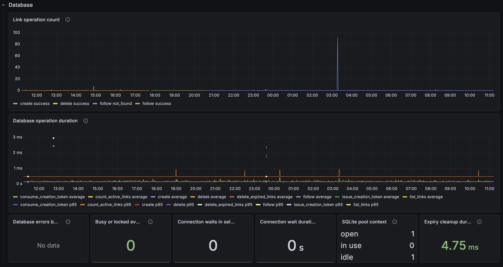
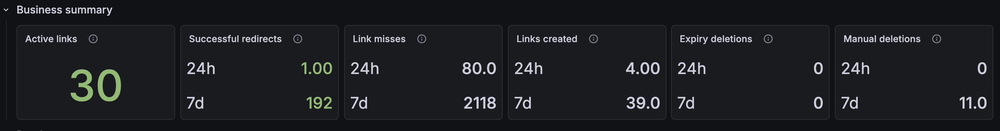
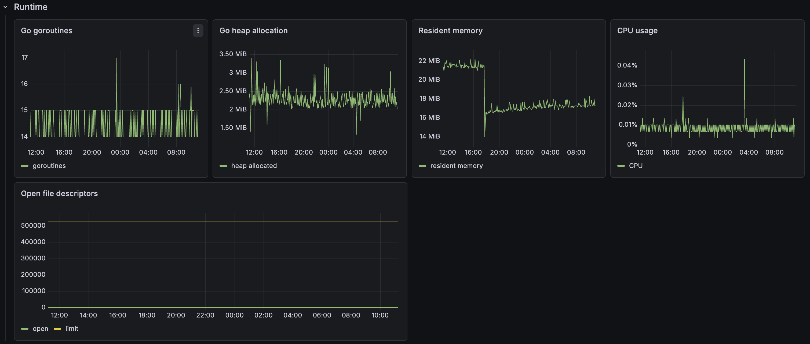
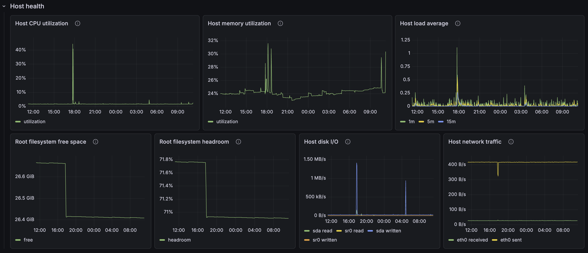

# Operator dashboard

Use the private **zibs operator overview** dashboard to triage a time range. Start with availability and request behavior, then narrow into database, logs, runtime, and host capacity. See [Observability](observability.md) for access and the full runbook.

## Overview

- **Requests in selected period** — establishes the traffic baseline for the chosen range.
- **Successful redirects in selected period** — confirms the primary user outcome is occurring.
- **Link misses in selected period** — spots invalid, expired, or scanned short codes.
- **5xx responses in selected period** — flags server failures; follow its Loki link for details.
- **Service up** — should be `1`; otherwise investigate the scrape path or service.
- **Process uptime** — identifies recent restarts.

## Traffic and latency

- **Request count by route and status** — locates the route and outcome driving traffic.
- **Response count by status** — highlights changes in successful, client-error, and server-error responses.
- **Request latency (normal range)** — checks ordinary request latency without isolated slow requests distorting the view.
- **In-flight requests** — shows concurrent work; sustained elevation can indicate blocked handlers.

## Database

- **Link operation count** — compares create, follow, and delete outcomes.
- **SQLite pool context** — checks open, in-use, and idle database connections.
- **Connection waits in selected period** — reveals contention for SQLite connections.
- **Connection wait duration in selected period** — shows how costly that contention was.
- **Expiry cleanup duration** — checks whether scheduled expired-link removal is slow or failing.
- **Database operation duration** — isolates slow database operations and their result.
- **Database errors by operation and kind** — identifies failing operations and error categories.
- **Busy or locked events in selected period** — a concise SQLite write-contention signal.

## Business summary

- **Links created** — creation volume for the dashboard's fixed summary period.
- **Successful redirects** — redirect volume for that period.
- **Link misses** — missing or expired-link activity for that period.
- **Manual deletions** — operator deletion activity for that period.
- **Expiry deletions** — links removed automatically by expiry cleanup.
- **Active links** — current count of unexpired links.

## Runtime and host health

- **Go goroutines** — detects accumulating concurrent work or leaks.
- **Go heap allocation** — checks memory growth in the Go runtime.
- **Resident memory** — shows the process's operating-system memory footprint.
- **CPU usage** — identifies application CPU pressure.
- **Open file descriptors** — detects descriptor growth toward process limits.

- **Host CPU utilization** — checks VM-wide CPU saturation.
- **Host memory utilization** — checks VM-wide memory pressure.
- **Host load average** — provides system-wide runnable or waiting-work context.
- **Root filesystem free space** — tracks free bytes on the volume holding Docker and persistent state.
- **Root filesystem headroom** — shows the same capacity risk as a percentage.
- **Host disk I/O** — helps correlate slow work with storage pressure.
- **Host network traffic** — provides external host traffic context, excluding loopback and Docker virtual interfaces.

## Logs

- **Recent zibs logs** — correlates the selected time range with structured request, lifecycle, and cleanup records; use it after a metric identifies the symptom.
