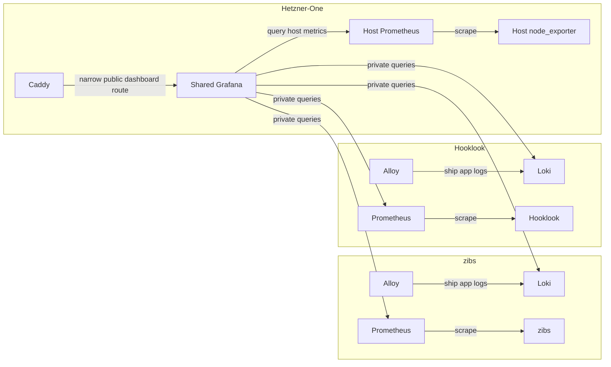

# V2 topology improvements

## Status and sequence

Planned follow-up work; no observability migration has been deployed by this
plan. The Caddy extraction is complete: Hetzner-One owns `zibs-edge` and
`hooklook-edge`, and the applications join their respective networks externally.

Before further zibs improvements, move Grafana out of both application
projects into Hetzner-One and add host monitoring there. For the time being,
zibs and Hooklook each retain their own Alloy, Loki, and Prometheus. Hetzner-One
runs an additional Prometheus for host monitoring; it does not replace the
application Prometheus servers.

Further zibs network segmentation follows that platform migration. Collector
centralization is outside this plan and requires a separate decision.

## Ownership after the platform migration

| Component | Owner | Responsibility |
| --- | --- | --- |
| Shared Grafana | Hetzner-One | Both applications' dashboards, host dashboard, datasource provisioning, credentials, runtime state |
| Host node_exporter and Prometheus | Hetzner-One | VPS metrics and host-metric history |
| zibs Alloy, Loki, Prometheus | zibs | zibs logs, metrics, and existing history |
| Hooklook Alloy, Loki, Prometheus | Hooklook | Hooklook logs, metrics, and existing history |
| Caddy and both edge networks | Hetzner-One | Shared ingress and narrow public-dashboard routing |

## Platform migration prerequisites and contracts

The Hetzner-One migration must preserve the existing zibs public dashboard
URL and sharing state, dashboard and datasource UIDs, and private operator
access. Migrate Grafana state with a consistent backup; never mount its SQLite
volume in two running Grafana instances. Preserve the Hooklook dashboard and
its datasource references when combining provisioning.

Shared Grafana needs private access to both apps' Prometheus and Loki, plus
Hetzner-One Prometheus. Choose explicit, distinct backend aliases: both apps
use service names such as `prometheus` and `loki`, so bare names are ambiguous
across shared networks. Record network ownership and aliases in the platform
migration plan before implementation.

Caddy must reach shared Grafana through an unambiguous alias. Preserve the
existing narrow public-dashboard route; normal Grafana workspace/API routes,
Prometheus, Loki, and application metrics remain private. Publish operator
access only on loopback, with SSH tunneling. Caddy access/error log collection
remains a Hetzner-One concern and is not part of zibs's Alloy pipeline.

Once shared Grafana is verified, remove each app's Grafana service and transfer
provisioning/deployment ownership to Hetzner-One. Update application deployment
scripts, credentials, smoke tests, and runbooks so subsequent deployments
cannot recreate local Grafana or require obsolete Grafana credentials.
Retain old Grafana volumes for rollback rather than deleting them at cutover.

## Later zibs cleanup

### Host monitoring

After Hetzner-One's node_exporter, Prometheus, and host dashboard are healthy,
remove zibs's node_exporter, its `node` scrape job, host dashboard panels, and
node-target smoke-test assertions. Temporary duplicate host scraping during
migration is acceptable. Keep zibs's application Prometheus and its existing
volume; do not split or copy host series into the platform TSDB. The platform
Prometheus begins its own host-metric history.

### Network segmentation

The current `zibs-edge` still connects zibs, Prometheus, node_exporter, Grafana,
and Caddy. After Grafana moves and host monitoring is verified, narrow that
edge to Caddy and zibs. Keep Hetzner-One's ownership of both application edge
networks.

Give zibs and its Prometheus a private metrics network. Keep Alloy and Loki on
private observability networking, and provide shared Grafana a documented
private query path to zibs Prometheus and Loki. Prometheus needs both its
scrape and query paths. Exact network names and cross-project ownership should
follow the implemented Hetzner-One Grafana migration, rather than introducing
a competing network scheme here.

Docker bridges are bidirectional connectivity, not per-port firewalls.
`expose` does not restrict listeners. Avoid attaching the public application
to the central Grafana query network, and verify connectivity after removing
old attachments.

### Application logs and verification

Keep the zibs Alloy/Loki pipeline and its retained data. A later hardening
change can restrict Docker discovery by both Compose project and service.
Filtering limits collection, not the host-wide access granted by the Docker
socket; changing that trust boundary is separate work.

Application-owned smoke tests should verify application health, scraping, and
log ingestion. Hetzner-One should verify shared Grafana, all five datasources,
the application and host dashboards, and the public shared-dashboard route.
Update docs and deployment scripts together with each ownership change.

## Rollout and rollback

1. Implement and verify shared Grafana plus host node_exporter/Prometheus in
   Hetzner-One, preserving dashboard state and existing app collectors.
2. Verify both apps' dashboards, all datasource queries, public-dashboard
   behavior, protected routes, and application health before retiring either
   old Grafana. Coordinate the Caddy upstream change with the migration.
3. Remove app-owned Grafana services and obsolete deployment assumptions so
   an ordinary app deployment preserves platform ownership.
4. Schedule the later zibs host-monitoring cleanup and network segmentation
   independently. Attach replacement network paths and verify them before
   removing existing connections.
5. Retain configuration backups and named volumes through the migration's
   rollback window. Restore Grafana state and routing together if needed;
   never run old and new Grafana against the same writable database.

## Completion criteria

- Hetzner-One owns one Grafana, host node_exporter, and host Prometheus.
- Each application still owns its Alloy, Loki, and Prometheus with preserved
  volumes and history.
- Normal app deployments cannot recreate an app-owned Grafana.
- Dashboards and datasource UIDs work, the existing public dashboard URL is
  preserved, and private routes remain private.
- After the later zibs cleanup, only Hetzner-One scrapes host metrics and
  zibs's edge no longer carries telemetry services.
- Application and platform checks pass, and rollback preserves app data,
  Grafana state, and Caddy certificates.
