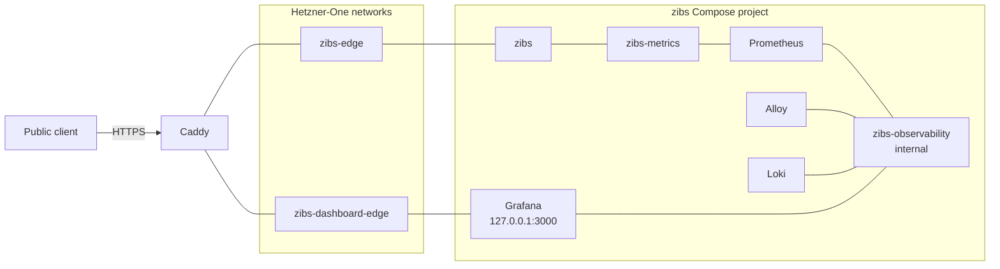

# V2 topology improvements

## Status

Deferred, independent follow-up work. This is not part of the Hetzner-One and
Hooklook observability rollout.

The current zibs production topology remains supported until this work is
explicitly scheduled. During that interval, both zibs and Hetzner-One may run a
node_exporter against the same VPS. That duplication is understood and
temporary; avoiding it is not worth coupling the two rollouts.

## Why revisit the topology

There are two independent motivations.

### Host monitoring no longer belongs to zibs

Hetzner-One will own a separate node_exporter, host Prometheus, and host
Grafana/dashboard. Once that platform path is deployed and verified,
node_exporter no longer needs to be part of zibs.

The later zibs change should remove:

- the `node-exporter` Compose service;
- the `node` scrape job from zibs Prometheus;
- node-target assertions from zibs telemetry smoke tests;
- VM CPU, memory, load, filesystem, disk-I/O, and network panels from zibs
  dashboards;
- zibs documentation that assigns host-health ownership to the application.

This leaves one authoritative host dashboard and keeps the zibs dashboard
focused on zibs application, process, SQLite, metrics, and logs.

### The current network mixes unrelated trust and ownership boundaries

The current `zibs_app-edge` network contains the public application,
Prometheus, node_exporter, Grafana, and the external Caddy attachment. That is
convenient, but it makes one network responsible for public ingress,
application metrics scraping, host metrics scraping, private datasource
queries, and public shared-dashboard routing.

Every container on a Docker bridge can initiate connections to the other
containers on that bridge. Read-only filesystems, dropped capabilities, and
`no-new-privileges` do not remove that network reachability. The current shape
therefore makes the intended connections less clear and gives a compromised
public application more lateral access than it needs.

Refining the segmentation improves both clarity and security:

- Caddy reaches only the zibs application listener and the deliberately shared
  Grafana dashboard surface;
- zibs reaches its Prometheus on a dedicated metrics network but cannot
  directly reach Loki or the private Grafana workspace;
- private telemetry services communicate on an internal observability network;
- each connection in the architecture corresponds to one documented purpose.

Docker networks are not directional firewalls. zibs and Prometheus must share
a metrics network, so either container can initiate traffic to the other.
Prometheus deliberately bridges the metrics and observability networks. The
useful improvement is removing unrelated services from the public edge and
keeping Loki and the private Grafana workspace unreachable from zibs.

## Target topology

The platform project owns the two external networks Caddy needs. The zibs
project declares them as external and owns its private metrics and
observability networks.

### Intended connections

| Source | Destination | Network | Purpose |
| --- | --- | --- | --- |
| Caddy | zibs `:8080` | `zibs-edge` | Public application reverse proxy |
| Caddy | Grafana `:3000` | `zibs-dashboard-edge` | Narrow externally shared dashboard routes |
| Prometheus | zibs `:9091` | `zibs-metrics` | Private application metrics scrape |
| Grafana | Prometheus `:9090` | `zibs-observability` | Metrics queries |
| Grafana | Loki `:3100` | `zibs-observability` | Private log queries |
| Alloy | Loki `:3100` | `zibs-observability` | Private log delivery |

No node_exporter remains in the zibs project. Host metrics are viewed in the
Hetzner-One Grafana workspace instead.

## Repository changes

### Compose and networks

- Remove the `node-exporter` service and its host mounts.
- Replace the broad `app-edge` network with:
  - platform-owned external `zibs-edge` for Caddy and zibs;
  - platform-owned external `zibs-dashboard-edge` for Caddy and Grafana;
  - zibs-owned `metrics` for zibs and Prometheus;
  - zibs-owned internal `observability` for Prometheus, Alloy, Loki, and
    Grafana.
- Make Prometheus dual-homed between `metrics` and `observability`.
- Keep Grafana on `127.0.0.1:3000` and attach it only to `observability` and
  `zibs-dashboard-edge`.
- Preserve all existing named volumes and service data.

### Metrics, logs, and dashboards

- Remove the node scrape job from `prometheus.yml`.
- Remove host panels and node target queries from the operator dashboard.
- Keep zibs process/runtime, HTTP, domain-operation, SQLite, cleanup, and log
  panels.
- Preserve the public metrics dashboard and its externally shared-dashboard
  state.
- Tighten Alloy discovery to match both the zibs Compose project and the zibs
  service before forwarding logs to Loki.

Alloy still mounts the Docker socket and can inspect host-wide container
metadata. Relabeling limits what it stores, not what the socket can expose.
Changing that trust model requires a separate logging-driver or socket-proxy
design.

### Operations and documentation

- Remove node checks from `scripts/telemetry-smoke-test.sh`.
- Keep the zibs smoke test focused on application metrics, logs, datasources,
  dashboards, and Grafana.
- Update deployment architecture, observability, deployment, diagnostics,
  port inventory, and rollback documentation.
- Link operators to the Hetzner-One runbook for host-dashboard access and host
  diagnostics.

## Migration prerequisites

- Hetzner-One host Prometheus, node_exporter, and the host dashboard are
  deployed and have passed their independent smoke test.
- Hetzner-One has created the external `zibs-edge` and
  `zibs-dashboard-edge` networks.
- Caddy can be attached to both new networks while retaining its legacy
  `zibs_app-edge` attachment during cutover.
- Current zibs Compose/configuration and named-volume inventories have been
  recorded for rollback.
- The normal zibs SQLite and Grafana backups are current and restore-verified.

## Rollout sequence

1. Confirm the Hetzner-One node target and host dashboard are healthy.
2. Attach Caddy to `zibs-edge` and `zibs-dashboard-edge` while retaining
   `zibs_app-edge` temporarily.
3. Validate the revised zibs Compose and telemetry configuration without
   changing production.
4. Deploy the revised zibs services without deleting or recreating named
   volumes.
5. Verify the application, private operator dashboard, public shared
   dashboard, Prometheus zibs target, Loki logs, Grafana datasources, and zibs
   telemetry smoke test.
6. Verify Hetzner-One host observability remained healthy during the zibs
   recreation.
7. Remove Caddy's legacy `zibs_app-edge` attachment.
8. Remove the legacy network only after no container uses it.
9. Retain the old zibs configuration and volumes through the agreed rollback
   window.

The platform Prometheus starts its own host-metric history. Do not attempt to
split or migrate node series out of zibs's mixed Prometheus TSDB. Retain the
old Prometheus volume through the rollback window, then let the new platform
retention policy become the authoritative history.

## Rollback

Reattach Caddy to `zibs_app-edge`, restore the previous zibs Compose,
Prometheus, dashboard, smoke-test, and documentation configuration, and
recreate the previous services against the same named volumes. Hetzner-One host
observability remains running; a zibs rollback does not require rolling back
the platform stack.

## Completion criteria

- zibs runs no node_exporter and stores no host metrics.
- Host panels exist only in the Hetzner-One host dashboard.
- Caddy, zibs, Prometheus, Loki, Alloy, and Grafana have only the documented
  network attachments.
- The private zibs workspace and public shared dashboard retain their current
  behavior.
- The zibs telemetry smoke test and the Hetzner-One host smoke test both pass.
- Restart and rollback procedures have been exercised without losing named
  volume data or Caddy certificate state.
