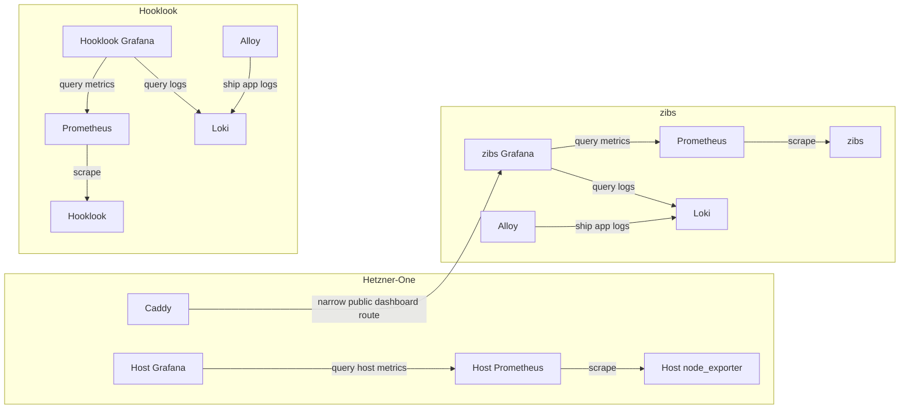

# V2 topology improvements

## Status and sequence

Planned follow-up work. The Caddy extraction is complete: Hetzner-One owns
`zibs-edge` and `hooklook-edge`, and the applications join their respective
networks externally.

Grafana centralization is canceled. zibs, Hooklook, and Hetzner-One will each
run their own Grafana instance. Both apps retain their Alloy, Loki, and
Prometheus services, dashboard provisioning, credentials, and Grafana state.

The next step is to deploy node_exporter and Prometheus in Hetzner-One.
Resume zibs improvements after that host-monitoring work is complete and
verified. This plan does not deploy or change any live services.

## Intended ownership

| Component | Owner | Responsibility |
| --- | --- | --- |
| Host Grafana, node_exporter, Prometheus | Hetzner-One | VPS dashboard, host metrics, and host-metric history |
| zibs Grafana, Alloy, Loki, Prometheus | zibs | zibs dashboards, logs, metrics, and existing history |
| Hooklook Grafana, Alloy, Loki, Prometheus | Hooklook | Hooklook dashboards, logs, metrics, and existing history |
| Caddy and both edge networks | Hetzner-One | Shared ingress and narrow public-dashboard routing |

Each Grafana queries its project's data sources. No shared Grafana database,
combined dashboard provisioning, or cross-application query network is needed.
Collector centralization is outside this plan and requires a separate decision.

## Contracts to preserve

Keep the zibs public dashboard URL and sharing state, dashboard and datasource
UIDs, and private operator access. zibs continues to own its Grafana service,
volume, credentials, provisioning, deployment path, and smoke tests. Hooklook
retains the equivalent ownership for its instance.

Caddy continues to reach zibs Grafana for the narrow public-dashboard route.
Normal Grafana workspace/API routes, Prometheus, Loki, and application metrics
remain private. Operator access remains through loopback ports and SSH tunnels.
Caddy access/error log collection belongs to Hetzner-One and is not part of
zibs's Alloy pipeline.

## Later zibs cleanup

### Host monitoring

After Hetzner-One's node_exporter, Prometheus, and host dashboard are healthy,
remove zibs's node_exporter, its `node` scrape job, host dashboard panels, and
node-target smoke-test assertions. Temporary duplicate host scraping during
migration is acceptable.

Keep zibs's application Prometheus and its existing volume; do not split or
copy host series into the platform TSDB. Hetzner-One Prometheus begins its own
host-metric history. Existing host series in zibs Prometheus age out through
normal retention rather than being deleted as part of the cutover.

### Network segmentation

The current `zibs-edge` connects zibs, Prometheus, node_exporter, Grafana, and
Caddy. After host monitoring is verified, separate ingress, application
scraping, and private telemetry queries while retaining zibs-owned Grafana.

The proposed later layout is:

- Existing Hetzner-One-owned `zibs-edge` for Caddy and zibs.
- A separate Hetzner-One-owned dashboard edge for Caddy and zibs Grafana,
  consumed externally by zibs. Confirm its name before implementation.
- A zibs-owned private metrics network for zibs and Prometheus.
- A zibs-owned internal observability network for Prometheus, Alloy, Loki,
  and zibs Grafana.

Prometheus needs both its scrape and query paths. Grafana needs its private
query paths and Caddy's public-dashboard path. Hetzner-One's Grafana and
Hooklook's Grafana need no attachment to these zibs networks.

Docker bridges are bidirectional connectivity, not per-port firewalls.
`expose` does not restrict listeners. Keep the public application off the
private telemetry query network and verify replacement connections before
removing old attachments. Preserve Hetzner-One's ownership of both existing
application edge networks.

### Application logs and verification

Keep the zibs Alloy/Loki pipeline and retained data. A later hardening change
can restrict Docker discovery by both Compose project and service. Filtering
limits collection, not the host-wide access granted by the Docker socket;
changing that trust boundary is separate work.

zibs smoke tests continue verifying application health, scraping, log
ingestion, Grafana, both data sources, and its dashboards. Hetzner-One verifies
its own host monitoring and Grafana independently. Keep deployment scripts,
network assumptions, credentials, and runbooks consistent with each change.

## Rollout and rollback

1. Deploy node_exporter and Prometheus in Hetzner-One and verify host metrics
   and their presentation in Hetzner-One's separate Grafana instance.
2. Resume zibs work: remove duplicate host monitoring only after that platform
   path is healthy. Preserve zibs Grafana and all application collectors.
3. Schedule zibs network segmentation separately. Attach replacement paths and
   verify application traffic, datasource queries, public-dashboard behavior,
   and protected routes before disconnecting existing paths.
4. Retain configuration backups and named volumes through the rollback window.
   Restore previous network memberships and zibs configuration if needed;
   the independent Hetzner-One monitoring stack can remain running.

## Completion criteria

- zibs, Hooklook, and Hetzner-One have separate Grafana instances.
- Hetzner-One owns host node_exporter and host Prometheus.
- Both apps retain their Grafana, Alloy, Loki, and Prometheus services, volumes,
  dashboard state, and deployment ownership.
- After zibs cleanup, it no longer runs node_exporter or scrapes host metrics.
- Existing dashboard UIDs and the public zibs dashboard URL work; private
  routes remain private.
- After segmentation, zibs's application edge carries only Caddy and zibs;
  its Grafana is reachable through the separate dashboard edge.
- Application and platform checks pass, and rollback preserves application
  data, Grafana state, and Caddy certificates.
